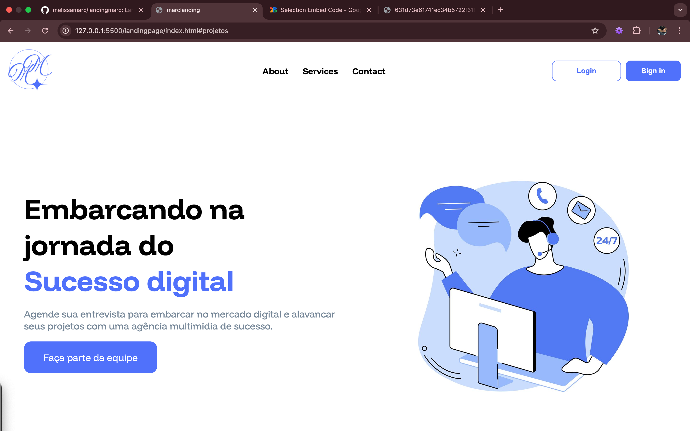
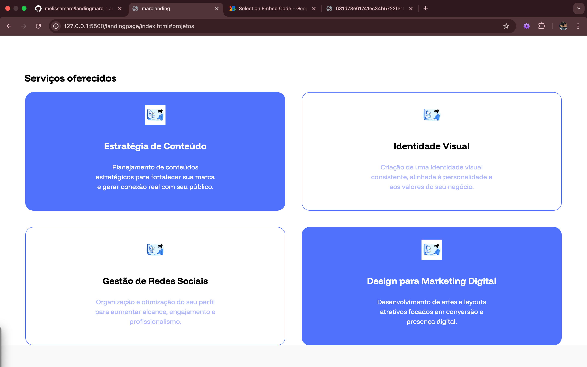
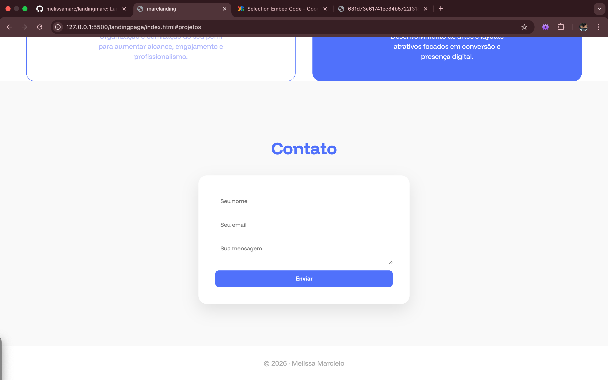

# 🌐 Landing Page – Agência Multimídia

Este projeto é uma **landing page institucional** desenvolvida com **HTML e CSS**, focada em apresentar uma agência multimídia, seus serviços, valores e um canal de contato.

O layout é moderno, responsivo e pensado para uma experiência clara e objetiva ao usuário.

---

## 🖼️ Preview do Projeto

### 🔹 Tela inicial

<p align="center">
  
</p>

### 🔹 Seção Sobre

<p align="center">
  
</p>

### 🔹 Serviços

<p align="center">
  
</p>

### 🔹 Contato

<p align="center">
  
</p>

---

## 🛠️ Tecnologias Utilizadas

- **HTML5**
- **CSS3**
- **Google Fonts**
  - Funnel Display
  - Funnel Sans

---

## 📂 Estrutura de Pastas

```bash
landingpage/
 ┣ assets/
 ┃ ┣ foto1.png
 ┃ ┣ foto2.png
 ┃ ┣ foto3.png
 ┃ ┗ foto4.png
 ┣ index.html
 ┣ styles.css
 ┗ README.md
```
